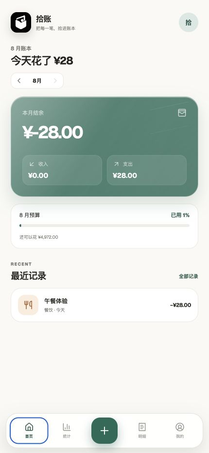
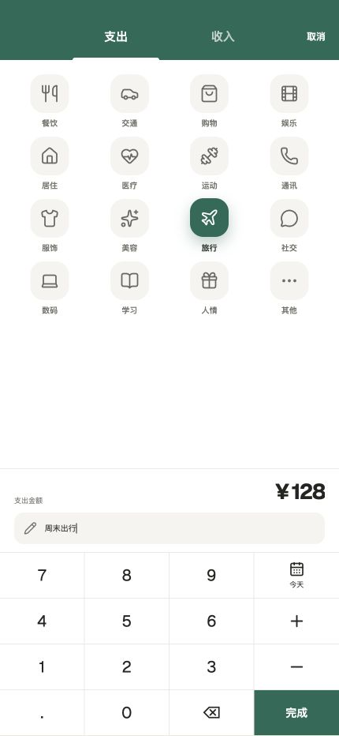
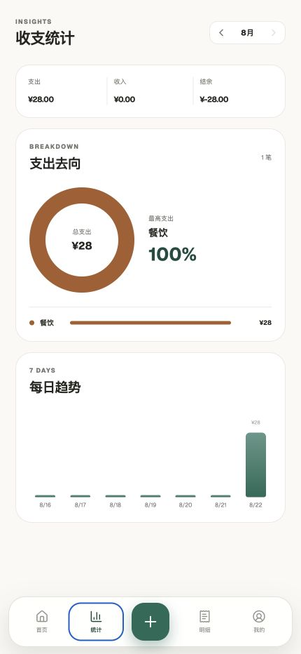
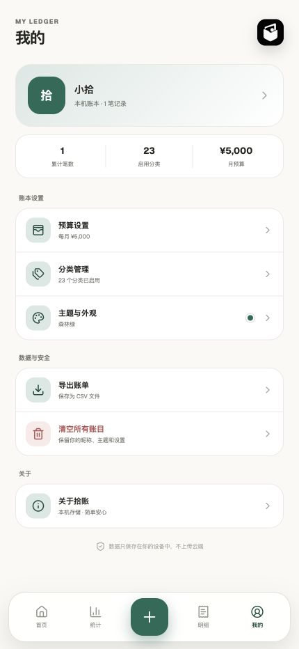

# 拾账

> 拾起每一笔，理清每一天。

一款面向日常使用的轻量个人记账应用。它把高频记账路径压缩到“选分类、输金额、完成”，同时提供预算、统计、自定义分类和个性化设置。账本数据默认只保存在当前设备。

[](LICENSE)
[](package.json)
[](capacitor.config.json)
[](https://github.com/Lesan-hub/shizhang-ledger/releases/latest)

## 两个独立版本

本仓库目前并行维护两个版本，二者不会互相覆盖：

| 版本 | 开发分支 | 适合人群 | 在线体验 |
| --- | --- | --- | --- |
| **拾账基础版（当前默认）** | [`main`](https://github.com/Lesan-hub/shizhang-ledger/tree/main) | 想快速记一笔、查看今日花费的用户 | [打开基础版](https://qingzhang-ledger.jliu88000.chatgpt.site) |
| **拾账 · 账户版（另一版本）** | [`edition/accounts`](https://github.com/Lesan-hub/shizhang-ledger/tree/edition/accounts) | 有微信、支付宝、银行卡、信用卡、分期或固定账单的职场用户 | [打开账户版](https://shizhang-accounts.jliu88000.chatgpt.site) |

账户版使用独立的本地存储和 Android 包名，可以与基础版同时安装、分别保存数据。账户版当前处于 `0.1` 预览阶段，基础版仍会在 `main` 分支持续维护。


## 界面预览

<table>
  <tr>
    <td align="center" width="50%">
      
      <br />
      <strong>首页概览</strong>
      <br />
      <sub>今日花费优先呈现，本月收支和预算作为补充</sub>
    </td>
    <td align="center" width="50%">
      
      <br />
      <strong>快速记账</strong>
      <br />
      <sub>选分类、输金额、完成，常用操作集中在一页</sub>
    </td>
  </tr>
  <tr>
    <td align="center" width="50%">
      
      <br />
      <strong>收支统计</strong>
      <br />
      <sub>分类占比和每日趋势帮助理解资金去向</sub>
    </td>
    <td align="center" width="50%">
      
      <br />
      <strong>我的账本</strong>
      <br />
      <sub>预算、分类、主题和数据管理统一整理</sub>
    </td>
  </tr>
</table>

> 截图中的账目与昵称仅用于界面演示；首次安装后默认从空账本开始。

## 在线体验

访问 [拾账在线版](https://qingzhang-ledger.jliu88000.chatgpt.site)。在线体验地址可能与本仓库最新提交存在短暂差异。

## 主要功能

- 极简记账：支出/收入切换、分类、金额、备注和日期集中在一个页面
- 今日优先：首页突出当天花费，一点即可查看今日支出明细
- 计算键盘：支持小数、加减运算和快速纠错
- 自定义分类：可添加、隐藏和删除支出或收入分类
- 月度概览：展示结余、收入、支出和预算使用进度
- 统计分析：按分类与月份查看收支构成和趋势
- 个性设置：支持昵称、本地头像和主题颜色
- 数据导出：可导出 CSV 账单作为备份
- 原生返回：Android 返回键或返回手势会先关闭记账/设置页面，再退出应用
- 干净起步：不预置示例账目，新账本从零开始

## 隐私设计

账目、预算、主题、自定义分类和个人资料保存在浏览器或 App 的本地存储中，不会由本项目主动上传到服务器。卸载应用、清除浏览器数据或清除 App 数据会移除本机账本，请定期导出 CSV 备份。

本项目没有账号系统或云同步能力，不建议把导出的真实账单提交到 Issue、Pull Request 或版本库中。

## 技术栈

- React 19 + TypeScript
- Next.js 16 / Vinext（Web）
- Vite（移动端静态资源构建）
- Capacitor 7（Android 容器与原生返回行为）
- Lucide React（界面图标）

## 快速开始

环境要求：Node.js 22.13 或更高版本，npm 10 或更高版本。

```bash
git clone https://github.com/Lesan-hub/shizhang-ledger.git
cd shizhang-ledger
npm install
npm run dev
```

开发服务器启动后，按终端提示访问本地地址。

## 常用命令

| 命令 | 作用 |
| --- | --- |
| `npm run dev` | 启动 Web 开发服务器 |
| `npm run lint` | 运行代码检查 |
| `npm run build` | 构建 Web 版本 |
| `npm run build:mobile` | 构建 Capacitor 使用的移动端资源 |
| `npm run android:sync` | 构建移动端资源并同步至 Android 工程 |
| `npm run android:build` | 构建 Android Debug APK |

## Android 构建

除 Node.js 外，还需要本机已安装兼容的 JDK 与 Android SDK：

```bash
npm install
npm run android:build
```

构建完成后，Debug APK 位于：

```text
android/app/build/outputs/apk/debug/app-debug.apk
```

如需使用 Android Studio 调试：

```bash
npx cap open android
```

## 项目结构

```text
app/                  Web 页面与全局样式
mobile/               移动端入口与图标资源
public/               Web 静态资源与项目预览图
android/              Capacitor Android 工程
www/                  已生成的移动端 Web 资源
capacitor.config.json Capacitor 应用配置
vite.mobile.config.ts 移动端构建配置
```

## 参与项目

欢迎提交问题和改进建议。开始贡献前请阅读 [CONTRIBUTING.md](CONTRIBUTING.md)；发现安全或隐私问题时，请遵循 [SECURITY.md](SECURITY.md)，不要直接公开敏感细节。

## 许可证

本项目采用 [MIT License](LICENSE)。
